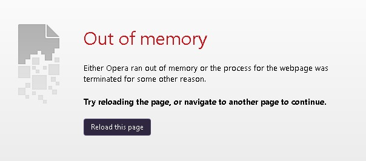
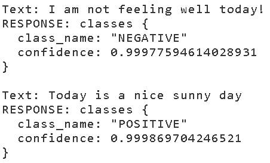
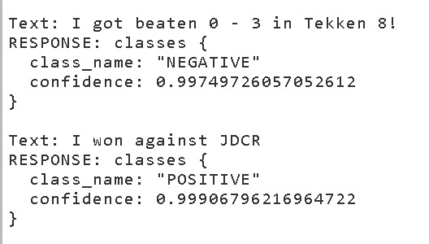
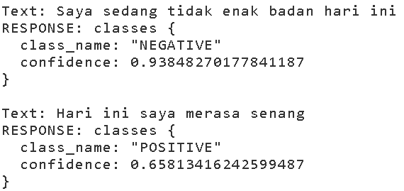

<h1 align="center"> Sentiment Analysis Using Caikit and Hugging Face </h1>

 
Nama                : Viriya Marhan Cunis

Asal Universitas    : Institut Teknologi Batam
  

  

Ini merupakan isi dari salah satu bentuk projek Sentiment Analysis menggunakan Caikit

Note : untuk bagian env saya tidak dapat mendownload semua dikarenakan library nya yang terlalu besar serta tidak bisa didownload lewat web dikarenakan sering terkena error

<h2 align="center"> Analisis</h2> 

Disini saya akan memberikan hasil analisis dari projek ini.

Sentiment Anaslysis merupakan salah satu bagian dari Hugging Face Model yang berguna untuk membuat AI melakukan analisis satu kalimat untuk menentukan perasaan dari kalimat tersebut.

Disini saya menggunakan Caikit dimana Caikit adalah salah satu toolkit AI yang memungkinkan user untuk mengmanage AI melalui beberapa API yang dev friendly.

Setelah mengikuti step yang diberikan, saya menggantikan kalimati yang diisi sesuai dengan ketentuan saya dan menjalankan programnya.

Hasil dari test nya adalah sebagai berikut :

Disini kita bisa melihat bahwa model ini dapat melakukan sentiment analysis dengan baik.

Disini kita bisa melihat bahwa model ini belum bisa melakukan sentiment analysis kalimat bahasa Indonesia dengan tepat

Dari hasil tersebut, bisa disimpulkan bahwa sentiment analysis akan melakukan analysis perasaan kalimat sesuai dengan kepositifan atau kenegatifan kalimat tersebut.

